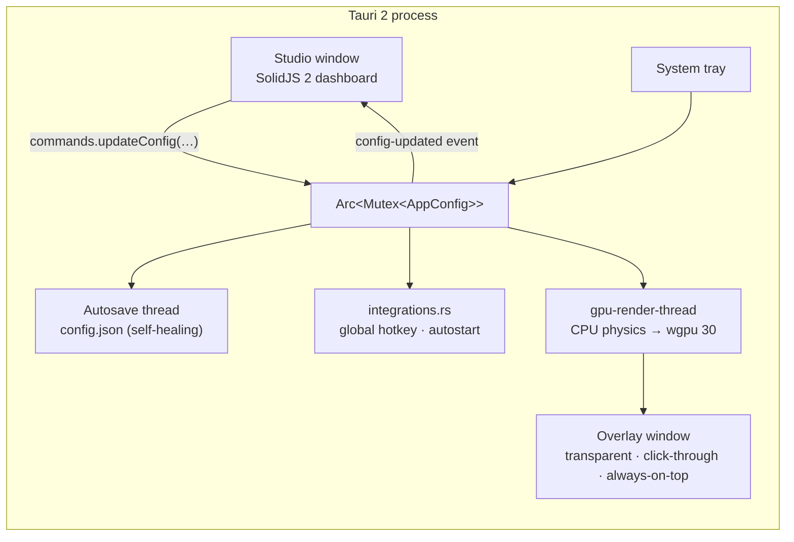
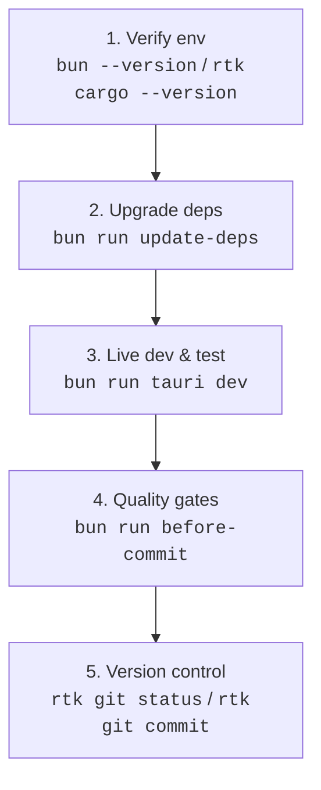

# FXCursor

[](https://v2.tauri.app)
[](https://bun.sh)
[](https://solidjs.com)
[](https://www.typescriptlang.org)
[](https://wgpu.rs)
[](https://rust-lang.org)
[](PROGRESS.md)

GPU-accelerated cursor effects for the desktop: a transparent, click-through overlay that renders a 4-layer luminous ribbon trail, a squishy cursor head, click ripples, particle bursts and orbiting satellites, plus a SolidJS 2 settings studio living in the system tray.

Built with **Tauri 2**, **Bun**, **SolidJS 2**, **TypeScript 7**, **wgpu 30** (Direct3D 12 / Vulkan / Metal) and **Rust**.

> **Status**: under construction. The single-process Tauri app is fully working on Windows (rendering, persistence, tray, hotkey, autostart). The headless "micro-daemon" described in `docs/V4_ARCHITECTURE_SPECIFICATION.md` is a prototype and is not used by the app yet. See [PROGRESS.md](PROGRESS.md) for the exact state and roadmap.

---

## ⚡ Primary Standard: Bun, Testing Command & RTK Rule

> [!CRITICAL]
> **1. Package Manager**: NEVER use `npm`, `npx`, `yarn`, or `pnpm`. **ALWAYS use `bun`**.
>
> **2. Ultimate Testing Command** (run from the repository root):
>
> ```bash
> bun run tauri dev
> ```
>
> **3. Always Pre-Release Dependencies**: keep every NPM and Crates.io dependency at its newest pre-release (`bun run update-deps`). Never downgrade to stable when a pre-release exists.
>
> **4. Golden Rule — `rtk` prefix**: prefix shell commands with `rtk` (`rtk git status`, `rtk cargo check --workspace`). Sanctioned `bun run ...` scripts run directly.
>
> | ❌ Wrong                  | ✅ Correct                                |
> | :------------------------ | :---------------------------------------- |
> | `git status`              | `rtk git status`                          |
> | `cargo check --workspace` | `rtk cargo check --workspace`             |
> | `cargo test --workspace`  | `rtk cargo test --workspace`              |
> | `bun run tauri dev`       | `bun run tauri dev` _(Bun scripts as-is)_ |

---

## ✨ Features (implemented)

- **4-layer master ribbon**: Outer Glow (150 % width, 39→50 % blur), Mid Shadow (90 %, black), Crisp Core (50 %, white), Inner Spine (15 %, black). Per-layer colours, gradient, alpha, blur; four fade curves; velocity-driven width and alpha. Each layer is a GPU-resolved union of round capsules, so joins and caps are round, hairpins never fold and overlaps never double-blend.
- **Squishy head**: velocity-elongated SDF ellipse with smoothed rotation.
- **Click ripples**: expanding anti-aliased rings, colour per mouse button.
- **Particle bursts**: gravity, friction, random spread, alpha decay.
- **Satellites**: orbiting bodies with optional orbit ring and counter-rotating dual ring.
- **Rainbow mode**: HSL cycling with saturation/lightness control, frame-rate independent.
- **Six presets** (Rust source of truth) and JSON import/export with self-healing.
- **Persistence**: `config.json` auto-saved (debounced) and repaired field-by-field on load; portable mode via a `portable` marker file.
- **System tray** (show / toggle / quit), **global toggle hotkey**, **login autostart**, single-instance guard, minimize-to-tray and start-minimized options, `--minimized` flag.
- **Multi-monitor**: overlay spans the Windows virtual desktop including negative coordinates.
- **Never-missed clicks (Windows)**: a low-level mouse hook queues every button press; the render thread parks on a condvar while idle and wakes on input.
- **Typed IPC**: `src/lib/bindings.ts` is generated by `tauri-specta`; a shared fixture keeps Rust and TypeScript defaults identical.
- **Effect modes**: Full, Ribbon only, Click effects only, Satellites only, Minimal (core + spine), switchable from the header.
- **Telemetry**: live fps, CPU per frame and geometry counts in the Developer Hub; Rust logs stream into the Dev Console.
- **Idle friendly**: GPU submissions stop when nothing on screen can change.
- **Legacy-faithful trail**: an optional LazyBrush dead-zone filters the pointer, the head is a Windhawk spring-damper toward that brush, the body is a spring chain with 0.3 second-neighbour coupling on a **1/120 s reference frame** (Windhawk `kReferenceFrameTime`), and a **512 px teleport-only** clamp bounds stretch on monitor jumps. As in Windhawk, V3 and the TD trail, width, fade and blur follow the **node index**, so the ribbon retracts into the cursor after a stop and rests as a 4-layer dot. Frames are **vsync-locked** (`Fifo`) with the pointer sampled right after the vblank; the Studio preview runs the same math (`src/lib/trail.ts`, tested against a Rust reference trace). **Defaults are trail-only** (`effect_mode: Ribbon`; head, ripples, particles, satellites off).
- **On-overlay FPS HUD** (`fps_counter`): frames per second drawn on the overlay with a 3×5 bitmap font, anchored to any corner.
- **GPU cursor bypass** (`gpu_cursor`): the system cursor shape is extracted and redrawn on the overlay — rotates with movement, bounces on click, and can hide the real cursor (restored on exit/panic).
- **Custom presets**: save the current look under a name; user presets live next to `config.json` and appear beside the six built-ins.
- **In-window shortcuts**: `Ctrl+S` save, `Ctrl+E` toggle effects, `Ctrl+1…9` switch tabs (cheat-sheet in the Hotkeys tab); the tray tooltip shows the live state.
- **Overlay snapshots**: Developer Hub button or `fxcursor.exe --capture out.png --capture-size 1280x720` while the app runs (screen-capture tools cannot see the GPU overlay). Add `--capture-burst 30 --capture-interval 50` for a flip-book of a transient; `scripts/snapshots/` drives the pointer through stops, reversals, turns, hairpins and loops and builds contact sheets.
- **Scriptable**: `fxcursor.exe --apply "{\"fps_counter\":{\"enabled\":true}}"` merges any partial configuration into the running app (self-healing, persisted) — handy for automation and for the snapshot tools.

---

## 🏗️ Architecture (as implemented)



Pipeline per frame (`crates/fxcursor-render/src/renderer.rs`): take the input frame (hook events on Windows) → spawn queued clicks → spring-damper chain → Catmull-Rom resampling from the cursor position (near-duplicate nodes merged) → one tapered round capsule per sample pair and layer + SDF instances → one render pass (per layer: depth max-coverage pre-pass, then colour pass; then billboards) with pre-multiplied alpha → present. Frames are skipped entirely after 3 settle frames when input, config and animation are all static.

The `crates/fxcursor-daemon` crate is an **experimental** standalone winit host for the same `fxcursor-render` renderer, with a JSON named-pipe server. It compiles, but nothing launches or talks to it; the prototype compute shader in the render crate is not dispatched. The roadmap in `PROGRESS.md` covers how it converges with the Tauri path.

---

## 📋 Standard Operating Procedure



```bash
# Step 1
bun --version && rtk cargo --version
# Step 2 (optional, bleeding edge)
bun run update-deps
# Step 3
bun run tauri dev
# Step 4
bun run typecheck && bun run lint && bun test
rtk cargo check --workspace && rtk cargo test --workspace
bun run before-commit        # all gates in one go
bun run arch                 # refresh ARCHITECTURE.md
# Step 5
rtk git status && rtk git add . && rtk git commit -m "feat: ..." && rtk git push
```

---

## 🔌 IPC surface (`src-tauri/src/lib.rs`)

| Command              | Direction         | Purpose                                                                             |
| :------------------- | :---------------- | :---------------------------------------------------------------------------------- |
| `get_config`         | UI → Rust         | Current `AppConfig`                                                                 |
| `update_config`      | UI → Rust         | Replace config; broadcasts + autosaves + syncs hotkey/autostart                     |
| `toggle_overlay`     | UI → Rust         | Flip `enabled`                                                                      |
| `reset_defaults`     | UI → Rust         | Factory defaults (persisted)                                                        |
| `save_config`        | UI → Rust         | Immediate write, returns the file path                                              |
| `list_presets`       | UI → Rust         | Built-in and user presets (`PresetInfo[]`)                                          |
| `apply_preset`       | UI → Rust         | Apply by id, sets `general.selected_preset`                                         |
| `save_user_preset`   | UI → Rust         | Save current look as a named user preset next to `config.json`                      |
| `delete_user_preset` | UI → Rust         | Delete a custom user preset                                                         |
| `import_config`      | UI → Rust         | Self-healing import of a JSON document; returns repaired paths                      |
| `get_diagnostics`    | UI → Rust         | OS, arch, version, portable flag, config path, virtual screen bounds                |
| `ping`               | UI → Rust         | Latency benchmark                                                                   |
| `get_recent_logs`    | UI → Rust         | Backend log history for the Dev Console                                             |
| `capture_overlay`    | UI → Rust         | Render the current overlay frame to a PNG (crop around the cursor or whole overlay) |
| `config-updated`     | Rust → UI (event) | Emitted after every change (tray, hotkey, IPC)                                      |
| `rust-log`           | Rust → UI (event) | Every `log` record from `fxcursor*` targets                                         |

---

## 📁 Project layout

The repository root **is** the app (`https://github.com/NairoDorian/FXCursor`). Earlier generations are kept under `legacy/` for reference only.

```
FXCursor/
├── AGENTS.md / README.md / PROGRESS.md / CHANGELOG.md / ARCHITECTURE.md
├── docs/                       # V4 specification & comparative research
├── package.json                # Bun scripts, SolidJS 2, Vite 8, TypeScript 7
├── src/                        # SolidJS 2 Studio
│   ├── App.tsx                 # shell, tabs, IPC sync, in-window shortcuts
│   ├── components/{Common,Preview,Tabs}/
│   └── lib/{bindings (generated),presets,effectMode,theme,toast,console,tauri}.ts
├── src-tauri/
│   ├── capabilities/default.json
│   ├── tauri.conf.json
│   └── src/
│       ├── lib.rs              # commands, tray, persistence wiring, overlay thread
│       ├── settings_repair.rs  # config store: self-healing load, atomic save, autosave, legacy migration
│       ├── user_presets.rs     # custom presets stored next to config.json
│       ├── integrations.rs     # global hotkey + autostart sync
│       ├── capture.rs          # overlay snapshots and bursts (offscreen render + readback)
│       ├── display.rs          # virtual desktop bounds, refresh rate, timer resolution
│       ├── input/{mod.rs,windows.rs}   # InputHub + WH_MOUSE_LL hook
│       ├── logger.rs · portable.rs · panic_log.rs · tracker.rs (non-Windows polling)
│       └── overlay/mod.rs      # surface, render loop, pacing, idle park, frame stats
├── crates/
│   ├── fxcursor-protocol/      # AppConfig, presets, self-healing deserializer (shared)
│   ├── fxcursor-render/        # THE renderer: TrailChain physics, capsule ribbon, SDF, HUD font, shaders
│   └── fxcursor-daemon/        # experimental headless host using fxcursor-render
├── scripts/                    # update-deps, before-commit, generate-arch, package-portable, version
│   └── snapshots/              # PowerShell drivers: trail shapes, motion bursts, contact sheets
├── test/                       # bun tests + shared Rust ⇄ TS fixtures
└── legacy/                     # V3 React app (project_cursor), original Windhawk mods, old scripts
```

---

## 📄 License

MIT License.
